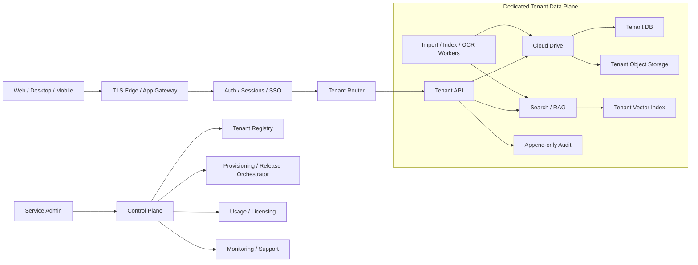
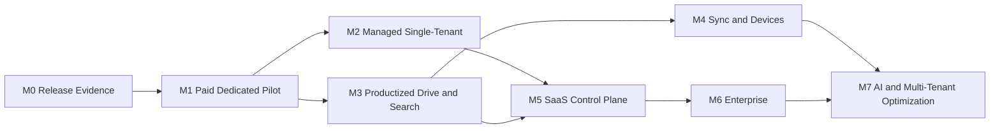

# Cloud Service Roadmap

Дата последнего пересмотра: 2026-07-11

Статус: основной delivery-roadmap для перехода от внутреннего single-tenant продукта к продаваемому управляемому облачному сервису.

Связанные документы:

- `PRODUCT_ROADMAP.md` описывает полный продуктовый горизонт: Cloud Drive, поиск, sync, RAG, чат, почта и агентные сценарии.
- `RELEASE_ROADMAP.md` хранит историю и критерии закрытого internal release.
- этот документ определяет ближайшую коммерческую цель, порядок облачных этапов и обязательные release gates.

## 1. Ближайшая Цель

Ближайшая релизная цель - **Paid Dedicated Pilot**: один клиент работает в отдельном контуре, использует Cloud Drive и поиск в реальных процессах, а команда может безопасно обновить, восстановить и диагностировать его без ручного доступа к документам.

Пилот продается как:

> Управляемое корпоративное облако с поиском по документам, безопасным доступом и импортом существующих файлов.

Sync, multi-tenant data plane, полный compliance, чат, почта и агент не входят в критический путь первой продажи.

## 2. Предпосылки И Ограничения

- Первые клиенты размещаются в выделенном single-tenant data plane: отдельные runtime, DB, object storage и vector index.
- Начальный профиль - до 100 тыс. файлов и один активный сервер приложения на tenant.
- Cloud Drive является источником истины; сетевые папки и сканеры остаются каналами импорта.
- SQLite допустим в выделенном single-host пилоте, пока нет multi-host writes и подтвержденной проблемы с конкурентной нагрузкой.
- Публичные ссылки выключены по умолчанию; первый безопасный сценарий sharing - внутренние пользователи и приглашенные гости.
- Для пилота нет внешнего SLA. Используются внутренние SLO, чтобы собрать факты перед коммерческими обещаниями.
- План рассчитан на последовательную работу небольшой команды. Календарные оценки пересматриваются после первого пилота и измерения фактической нагрузки.

## 3. Текущая База И Разрыв

Подтвержденная база:

- Cloud Drive registry: файлы, папки, версии, корзина, move/rename/delete/restore.
- Local и S3/MinIO storage contracts.
- Qdrant + lexical/BM25 search, eval baseline, RAG citations/fallback.
- Registry ACL: `viewer/editor/admin`, path/folder/file grants, API/search filtering.
- Admin UI для Cloud Drive, import sources и ACL.
- Durable import/reindex jobs, index coverage diagnostics и stale-job recovery.
- Backup/restore basics, redacted support bundle и Docker smoke.
- Web UI, launcher, CLI и Telegram integration.

Ближайшие release blockers для платного пилота:

- завершенный sharing workflow в Explorer, группы и понятный `who has access`;
- стабильность web-сессии: без самопроизвольной полной перезагрузки, потери результатов и ложных reconnect alerts;
- повторяемый fresh install, upgrade и rollback на чистой среде;
- автоматический backup и документированный restore drill;
- audit trail для login, download, share, permission change, delete/restore и admin actions;
- health/operations view: web, workers, storage, index coverage, jobs и backup freshness;
- security defaults: secrets, session policy, TLS termination, rate limits и public links off by default;
- pilot runbook, support boundaries и критерии приемки клиента.

Задачи sync, общего control plane и multi-tenant data plane не являются блокерами первого пилота.

## 4. Целевая Архитектура

Граница владения данными:

- control plane хранит tenant metadata, release state, aggregate usage и health, но не содержимое документов;
- tenant data plane хранит пользователей/группы, ACL, документы, версии, jobs, search index и audit;
- support получает диагностические данные через redacted telemetry/support bundle; доступ к содержимому требует явного, ограниченного и аудируемого разрешения клиента.

## 5. Сквозные Release Gates

Эти требования не являются отдельной поздней фазой. Они усиливаются на каждом этапе.

### Security And Privacy

- ACL применяется одинаково в list/search/preview/download/share/RAG.
- Public links выключены по умолчанию, имеют срок действия, revoke и отдельный audit event.
- Секреты не хранятся в Git, логах, support bundle и browser storage.
- TLS, secure cookies, session expiration, brute-force/rate-limit policy документированы и проверены.
- Автоматизированный negative test доказывает отсутствие cross-user и cross-tenant доступа.

### Reliability And Recovery

- Любая долгая операция имеет job id, видимый progress, retry и диагностируемую ошибку.
- Перезапуск web/worker не теряет durable jobs и результаты завершенного поиска.
- Полная перезагрузка страницы не используется как обычный способ обновления UI.
- Backup считается рабочим только после restore drill на пустом target и проверки выборки файлов, ACL и registry state.
- Миграция имеет preflight, backup, forward path и проверенный rollback/restore path.

### Observability And Support

- Correlation/request id связывает browser action, API request и background job.
- Health показывает web, DB, object storage, Qdrant, workers, queue lag, index coverage и backup freshness.
- Audit отделен от технических логов и отвечает: кто, что, над каким объектом, когда и с каким результатом сделал.
- Support bundle редактирует secrets и персональные данные по явной политике.

### Performance And UX

- Нажатие дает видимую реакцию не позднее 150 мс; длительная операция показывает progress/skeleton и допускает безопасный retry.
- Для pilot profile до 100 тыс. файлов warm search p95 не выше 4 с на согласованном hardware profile; exact-name path должен быть заметно быстрее content search.
- Search eval хранит Recall/MRR/zero-result/p50/p95 по категориям и является required gate для retrieval changes.
- Responsive smoke покрывает search/explorer/index/settings на 480/900/1280 px без недоступной навигации и горизонтального overflow страницы.

### Operations

- Внутренние pilot SLO: availability 99.5% в месяц, RPO <= 24 ч, RTO <= 8 ч. Это цели эксплуатации, не клиентский SLA.
- Инциденты имеют severity, owner, timeline и post-incident action list.
- Cost snapshot учитывает storage, egress, indexed files, OCR pages, embeddings и LLM usage до определения тарифов.

## 6. Delivery Milestones

### M0. Release Evidence

Статус: in progress.

- DONE 2026-07-10: явный `RAG_CONFIG_PATH` изолирует test/pilot config от project `config.json` и покрыт regression-тестом.
- DONE 2026-07-10: после Explorer responsiveness stage полный regression gate проходит (`570 passed`), `ruff check src tests scripts` green.
- DONE 2026-07-11: NiceGUI reconnect gap больше не вызывает hard reload: browser offline smoke восстановил тот же client за 1.3 с без видимого overlay, `beforeunload` и потери DOM; transport lifecycle пишет disconnect/reconnect reason и downtime.
- DONE 2026-07-11: SQLite startup не переписывает уже активный WAL mode на каждом соединении; launcher restart поднимает web и bot без `disk I/O error`. Повреждённый telemetry WAL из incident сохранён отдельно, основной DB checkpoint проверен на read/write.
- DONE 2026-07-11: Telegram transport errors и segmented logs редактируют bot/Bearer tokens; существующая локальная история очищена от действующего token.
- DONE 2026-07-11: полный regression gate после web/recovery hardening проходит (`577 passed`, 4 warnings), `ruff check src tests scripts` green.

Цель: превратить существующий работающий baseline в воспроизводимый release candidate.

Результаты:

- fresh install и Docker smoke на чистой среде;
- focused cloud/search/UI tests и full test report;
- Cloud Drive E2E: upload -> index -> search -> preview/download -> delete/restore;
- search eval artifact и hardware profile;
- restore drill с проверкой registry, ACL и случайной выборки content checksums;
- browser smoke на session reconnect, search state и отсутствие hard reload;
- versioned release notes и clean tag.

Exit gate: другой инженер поднимает и проверяет release по документации без знания локальной машины разработчика.

### M1. Paid Dedicated Pilot

Статус: next release target.

Цель: первый клиент может ежедневно пользоваться облаком и поиском в выделенном контуре.

Результаты:

- DONE 2026-07-10: Explorer sharing для пользователей/ролей: grant/revoke и `who has access` без перезагрузки страницы;
- IMPLEMENTED 2026-07-10: группы и membership management: immutable group ID, active/archive lifecycle, admin UI/API и group ACL в Explorer/API/search; остаётся browser smoke экрана управления группами;
- DONE 2026-07-10: public links как default-off tenant policy: строгий expiration, active list, copy/revoke, API enforcement и audit без сырого token;
- IMPLEMENTED 2026-07-11: устранены измеренные Explorer stalls и hard reload при кратком reconnect; остаются authenticated browser smoke сохранения search state, экран групп и responsive smoke остальных экранов;
- IMPLEMENTED 2026-07-11: audit coverage для login/session, ACL-denied read/write, preview/download, public share access, permission/share changes, delete/restore и admin actions; остаются pilot audit review/export acceptance и correlation IDs;
- IMPLEMENTED 2026-07-11: admin operations status различает missing/stale/unverified/verified backup, а HTTP/API logs и audit связаны correlation ID; остаётся объединить web/DB/Qdrant/workers/queue/index coverage в одном health view;
- IMPLEMENTED 2026-07-11: local backup включает online SQLite snapshots, object files, SHA-256 manifest и redacted config; добавлены verify-backup, restore-drill artifact и fresh-install/upgrade preflight; остаются scheduled execution, rollback rehearsal и S3 provider procedure;
- pilot onboarding, acceptance checklist, support runbook и data-processing boundaries;
- простая лицензия без сложного online billing.

Exit gate: пользователь без помощи администратора загружает, находит, открывает, делится и восстанавливает документ; администратор видит доступы и аудит; команда выполняет update и restore drill.

### M2. Managed Single-Tenant Cloud

Цель: несколько выделенных tenant можно поддерживать с одинаковым процессом.

Результаты:

- idempotent tenant provisioning;
- per-tenant domain, secrets, DB, bucket и Qdrant instance/config;
- scheduled encrypted backups and automated restore verification;
- release rings `internal/pilot/stable`;
- centralized health без содержимого tenant documents;
- usage snapshot: users, storage, indexed files, OCR pages, embeddings/LLM;
- suspend/export/delete tenant lifecycle с audit.

Exit gate: новый tenant поднимается повторяемо, rollout можно остановить, а restore выполняется в целевой RTO без утечки credentials.

### M3. Productized Drive And Search

Цель: продукт ощущается как корпоративное облако, а поиск становится измеримым преимуществом.

Результаты:

- bulk operations, drag/drop upload, folder ZIP, recent/favorites/shared-with-me;
- upload progress, retry, failed upload list, streaming and resumable transfers;
- PDF/image/Office preview where safe;
- registry filters by name/path/type/date/size/owner;
- structural chunking and provenance to version/page/sheet/row/chunk;
- typo tolerance, explain mode and eval dashboard;
- quotas, activity timeline, checksum verification and object GC report.

Exit gate: основные user journeys проходят без admin intervention, search thresholds соблюдаются, move/delete/ACL changes не оставляют stale or leaked results.

### M4. Sync And Device Management

Цель: Windows-пользователь работает через привычную локальную папку без потери версий.

Результаты:

- Windows sync client, selective sync and conflict inbox;
- resumable transfer, bandwidth policy and offline retry;
- device identity, revoke and client audit;
- auto-update, logs and support export;
- macOS/Linux/mobile только после стабилизации протокола.

Exit gate: sync переживает restart/network loss; конфликт не теряет версии; revoked device перестает получать изменения.

### M5. SaaS Control Plane

Цель: централизовать коммерческое управление, не объединяя tenant data planes преждевременно.

Результаты:

- tenant registry and lifecycle;
- plan/license/subscription model and billing export;
- customer admin and service admin portals;
- release/migration orchestration and incident dashboard;
- reconciled usage metering and quota enforcement.

Exit gate: create/suspend/export/delete и rollout работают из control plane; usage report сходится с tenant source systems.

### M6. Enterprise Security And Compliance

Цель: продавать компаниям с корпоративным identity и формальными требованиями к данным.

Результаты:

- OIDC SSO, MFA policy and AD/LDAP group sync where required;
- immutable audit export, retention and legal hold;
- per-tenant encryption keys and secrets rotation;
- antivirus/DLP hooks and risky-admin-action approval;
- customer-controlled support access and regional placement policy.

Exit gate: threat model и penetration test закрыты; SSO/groups/ACL согласованы; legal hold блокирует purge; audit export подтвержден клиентом.

### M7. AI Layer And Multi-Tenant Optimization

Цель: добавлять AI и разделяемую инфраструктуру только после доказанной экономики и изоляции.

AI results:

- local/remote model profiles, tenant policy and budgets;
- permissions-aware RAG with source/version/chunk citations;
- safe fallback for unsupported/conflicting answers;
- human approval for agent actions.

Multi-tenant results:

- threat model and isolation tests for API, DB, storage, vectors, cache and logs;
- noisy-neighbor controls, per-tenant keys and regional placement;
- tenant purge evidence and multi-tenant load tests;
- RPO/RTO and incident drills per commercial plan.

Exit gate: shared data plane lowers measured cost without weakening isolation, latency or recovery. До этого момента остается выделенный tenant data plane.

### Зависимости И Плановые Диапазоны

Milestones не обязаны идти строго последовательно: после M1 операционный поток M2 и продуктовый поток M3 могут выполняться параллельно. M4 зависит от hardened transfer protocol из M3, а M5 имеет смысл после повторяемого M2 и появления нескольких tenant.

Оценка предполагает два параллельных потока - backend/operations и UI/product - без срочной customer-specific интеграции:

| Результат | Плановый Диапазон | Комментарий |
|---|---:|---|
| M0 release evidence | 1-2 недели | В основном проверка, фиксация и автоматизация уже существующего baseline |
| Retrieval v3 decision spike | 5-10 рабочих дней внутри M0/M1 | Сначала representative sample и shadow collection; полный 4M-point reindex только после go/no-go |
| M1 paid dedicated pilot | еще 4-8 недель | Основной риск - sharing/groups, web stability, audit и repeatable recovery |
| M2 managed single-tenant | 6-10 недель после M1 | Может идти параллельно с продуктовой работой M3 |
| M3 productized drive/search | 8-16 недель после M1 | Объем регулируется фактической обратной связью пилота |
| M4 Windows sync | 3-5 месяцев после стабильного transfer protocol | Требует отдельной матрицы restart/network/conflict tests |
| M5 control plane | 3-6 месяцев после появления 3-5 tenant | Раньше этого вероятна преждевременная автоматизация |
| M6 enterprise | По контрактному спросу | SSO может быть вынесен раньше, если блокирует конкретную продажу |
| M7 shared data plane | После доказанной unit economics | Не имеет календарного обязательства до isolation/load evidence |

Диапазоны пересматриваются на каждом exit gate. Это planning range, а не обещание клиенту.

## 7. Ближайший Backlog

### P0 - До Paid Dedicated Pilot

1. DONE 2026-07-10: Explorer sharing для пользователей/ролей, `who has access`, expiration/revoke и default-off public-link policy.
2. IMPLEMENTED 2026-07-10: группы/membership и group sharing подключены к session, Explorer, API и search ACL; закрыть browser smoke экрана управления группами.
3. IMPLEMENTED 2026-07-11: основной Explorer event-loop stall устранён (`ACL 3.3 с -> 11 мс`, размеры root `>60 с -> 87 мс`), краткий transport reconnect больше не делает hard reload, а multi-process telemetry переведена с аварийного WAL на rollback journal (`/api/ui-events` после recovery 34-338 мс вместо 6-18 с); закрыть authenticated browser smoke search-state и responsive smoke остальных экранов.
4. IMPLEMENTED 2026-07-11: audit coverage и negative ACL tests закрывают login/session, ACL-denied read/write, preview/download, public share, permission/share changes и delete/restore; до DONE провести pilot audit review/export acceptance вместе с correlation IDs.
5. IMPLEMENTED 2026-07-11: fresh-install/upgrade preflight, consistent local backup, archive verification и restore drill автоматизированы; до DONE добавить scheduler, rollback rehearsal и S3 provider procedure.
6. IMPLEMENTED 2026-07-11: единый admin UI/API health snapshot за ~0.65 с объединяет registry/telemetry DB, object storage, Qdrant, index state, worker states, pending jobs/oldest queue lag, backup freshness и restore drill; HTTP responses/logs/audit получают correlation ID. До DONE подтвердить admin browser smoke и согласовать alert thresholds на pilot load.
7. IMPLEMENTED 2026-07-11: retrieval eval и GO/NO_GO gate поддерживают versioned profile, document/chunk/page ground truth, no-answer, ACL leakage, coverage, p95 и regression относительно baseline; faithfulness остаётся явным блокером, а не подменяется retrieval metric. До DONE собрать размеченный `retrieval_v3_golden.json`, прогнать `legacy`, `release_v2`, multilingual dense и multilingual reranker в shadow collection, затем зафиксировать победителя, pilot hardware profile и Cloud Drive E2E artifact.
8. IMPLEMENTED 2026-07-11: `docs/PILOT_RUNBOOK.md` фиксирует scope/data boundaries, роли, onboarding, user/admin/operator acceptance, release/rollback gate, severity и incident procedure; до DONE выполнить runbook на чистом contour и получить pilot sign-off.

### P1 - После Запуска Пилота

1. Streaming/resumable transfers, checksum verification and object GC.
2. Usage/cost metering and simple licensing enforcement.
3. Idempotent tenant provisioning and scheduled backup verification.
4. Product views: recent, favorites, shared-with-me, activity.
5. Search provenance, structural chunking and required CI eval gate.

### P2 - После Подтверждения Пилота

1. Windows sync client hardening.
2. Control plane and release rings.
3. OIDC/AD/compliance according to signed customer requirements.
4. Shared data-plane feasibility only after cost and threat-model review.

## 8. Принятые Архитектурные Решения

| Вопрос | Решение Сейчас | Условие Пересмотра |
|---|---|---|
| Первое размещение | Managed/dedicated single-tenant | Не менее 3-5 похожих tenant и подтвержденная стоимость ручного управления |
| Основная DB | SQLite для single-host pilot | Multi-host writes, устойчивое lock contention или требования HA |
| Qdrant isolation | Отдельный instance/config на hosted pilot | Общий cluster только после isolation/load tests |
| Object storage | Отдельный bucket и credentials на tenant | Shared bucket только при доказанной key/prefix isolation и выгоде |
| Public links | Feature flag, default off; invited/internal sharing first | Явный customer demand и принятая external-sharing policy |
| SSO | Не блокирует первый малый pilot | Обязателен до клиента, который не принимает local accounts |
| OCR execution | Tenant worker/data plane | Shared pool только с encrypted isolation и cost justification |
| Pilot recovery | Internal RPO <= 24 ч, RTO <= 8 ч | Уточнить по restore drills и контракту клиента |
| Control plane | После повторяемого dedicated pilot | Начать раньше только если второй tenant уже создает operational pain |
| Billing | Простая лицензия + usage snapshot | Полный billing после подтверждения тарифов и unit economics |
| Retrieval evolution | Сохранить рабочий индекс как baseline; новые embeddings/reranker проверять на shadow collection и включать только по eval/latency/storage gate | GraphRAG, RAPTOR, RLM/agentic retrieval только при подтверждённых multi-hop/whole-corpus failures |

## 9. Риски И Revisit Triggers

- **Data leak:** любой ACL bypass или cross-tenant finding останавливает rollout и требует проверки всех access paths.
- **Web stability:** hard reload, потеря search state или ложный reconnect во время обычного действия являются release blockers M1.
- **Recovery:** backup без успешного restore drill не считается backup; превышение RTO требует пересмотра storage/DB topology.
- **SQLite ceiling:** повторяемые lock/contention incidents или необходимость нескольких app writers запускают ADR по Postgres.
- **Search cost/latency:** выход p95 за budget или рост index lag требует профилирования до добавления AI features.
- **Search migration cost:** текущий `catalog` содержит около 4.04 млн points; переход 384 -> 1024 float32 dimensions увеличивает только сырые vectors примерно с 6.2 до 16.6 GB до HNSW/payload overhead, поэтому полный reindex нельзя начинать без sample benchmark и capacity check.
- **Support cost:** более двух ручных диагностических сессий на tenant в месяц приоритизируют observability/control-plane work.
- **Scope:** chat, mail, mobile и agent не вытесняют P0-задачи пилота без подтвержденной сделки.

## 10. Definition Of Done

### Продаваемый Dedicated Cloud

- tenant provision/update/backup/restore/suspend повторяемы и аудируемы;
- пользователь выполняет основные file/search/share/recovery workflows без администратора;
- администратор управляет users/groups/ACL/import/jobs/backups/audit;
- support диагностирует проблему по health, correlation id и redacted bundle;
- search quality, latency, index coverage и backup freshness измеряются;
- release имеет acceptance tests, migration preflight и rollback/restore path.

### Полноценный Облачный Сервис

- control plane управляет tenant lifecycle, releases, usage, plans and incidents;
- isolation, deletion and recovery доказаны автоматизированными тестами и drills;
- SSO, audit export, retention and support access соответствуют целевому сегменту;
- billing/licensing опираются на проверяемый metering;
- sync или другой клиентский access channel стабилен на поддерживаемых платформах;
- AI включается tenant policy и никогда не расширяет права пользователя.
