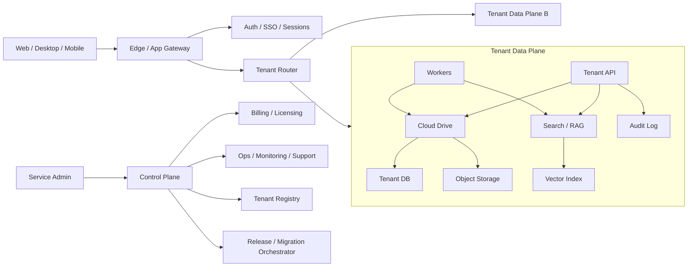

# Cloud Service Roadmap

Дата: 2026-07-04

Статус: стратегический roadmap для перехода от single-tenant корпоративного Cloud Drive к полноценному облачному сервису.

## 1. Цель

Построить коммерческий облачный сервис для компаний:

- корпоративное хранилище документов;
- быстрый поиск по файлам, папкам и содержимому;
- права доступа, группы, sharing и аудит;
- web, desktop sync, mobile clients;
- hosted deployment с управляемыми обновлениями, backup, monitoring и поддержкой;
- позже: RAG, чат, почта, автоматизация документов и агентные сценарии.

Короткая формулировка:

> Управляемое корпоративное облако с поиском по документам, безопасным доступом, синхронизацией и AI-слоем, которое можно продавать как hosted service или выделенный managed tenant.

## 2. Стратегия Выхода

Не прыгать сразу в общий multi-tenant SaaS. Правильная лестница:

1. **Single-tenant pilot**: отдельный сервер/контур на клиента.
2. **Managed single-tenant cloud**: мы хостим отдельный tenant per customer.
3. **Hybrid SaaS**: общий control plane, но изолированные data planes для клиентов.
4. **Multi-tenant SaaS**: общий control plane и общий data plane там, где это безопасно и экономически оправдано.
5. **Enterprise Cloud**: SSO, compliance, retention, legal hold, audit export, SLA.

Причина: документы клиентов - чувствительные данные. Изоляция, backup, incident response и юридическая ответственность важнее ранней экономии на инфраструктуре.

## 3. Текущая База

Уже есть или частично готово:

- Cloud Drive registry: файлы, папки, версии, корзина, move/rename/delete/restore.
- Storage backends: local и S3/MinIO contract.
- Search/RAG foundation: Qdrant, lexical/BM25, eval, RAG citations/fallback.
- ACL foundation: `viewer/editor/admin`, path/folder/file grants, API/search filtering.
- Admin UI baseline: Cloud Drive settings, import sources, ACL management.
- Import/scanner ingestion: sources, durable import jobs, reindex jobs.
- Backup/restore basics, support bundle, Docker smoke.
- NiceGUI web UI, CLI, launcher, Telegram integration.

Главные gaps до полноценного облачного сервиса:

- tenant model и изоляция данных;
- hosted deployment/control plane;
- groups membership UI и SSO/OIDC;
- billing/licensing/subscription;
- production backup/DR и upgrade/migration policy;
- observability, audit export, admin health dashboard;
- hardened upload/download: multipart, resumable, streaming, checksum verification;
- sync clients and device management;
- commercial-grade sharing UX and external access policy.

## 4. Целевая Архитектура

Принцип: control plane управляет клиентами, лицензиями, rollout и мониторингом. Tenant data plane хранит документы, индексы, права и audit. На ранних этапах data plane лучше держать выделенным для каждого клиента.

## 5. Roadmap

### Phase 0. Pilot-Ready Single Tenant

Цель: текущий продукт можно поставить первому клиенту в выделенный контур.

Обязательные результаты:

- clean install по README;
- Docker Compose deployment без ручного шаманства;
- web UI: search, explorer, Cloud Drive, settings, admin center;
- upload/download/preview/version/trash/restore;
- import folders для сканеров;
- ACL UI для пользователей/ролей;
- sharing внутри компании и базовые public links;
- backup/restore command проверен на отдельном restore target;
- support bundle собирает config/logs/status без секретов;
- release smoke checklist повторяемый.

Gates:

- `pytest` focused cloud/search/ui green;
- Docker smoke green;
- Cloud Drive E2E: upload -> index -> search -> preview/download -> delete/restore;
- search eval baseline сохранен;
- `git status --short` clean перед tag.

### Phase 1. Managed Single-Tenant Cloud

Цель: мы хостим отдельный tenant per customer и можем поддерживать его удаленно.

Обязательные результаты:

- tenant provisioning script;
- per-tenant config, domain, storage bucket, DB, Qdrant collection;
- automated deployment/update script;
- migration runner with rollback policy;
- encrypted secrets storage;
- scheduled backups with restore drill;
- health checks and uptime monitoring;
- admin support bundle download;
- simple license/subscription flag.

Gates:

- новый tenant поднимается одной командой;
- backup restore проверяется на пустой среде;
- update не ломает существующий tenant;
- storage and DB credentials не попадают в logs/support bundle.

### Phase 2. Productized Cloud Drive

Цель: сервис ощущается как облако документов, а не как админский инструмент.

Обязательные результаты:

- polished Explorer: bulk actions, context menu, drag/drop upload, folder download zip;
- sharing UX: users/groups/public links, expiration, revoke, copy link;
- groups and membership UI;
- external guests with restricted access;
- favorites/recent/shared-with-me views;
- document preview for PDF/images/Office where possible;
- upload progress, retry, failed uploads;
- quotas per user/folder/tenant;
- file activity timeline.

Gates:

- обычный пользователь может загрузить, найти, открыть, поделиться и отозвать доступ без админа;
- админ видит who has access для файла/папки;
- sharing respects ACL in search, preview, download and RAG.

### Phase 3. Search Cloud Quality

Цель: поиск становится конкурентным преимуществом сервиса.

Обязательные результаты:

- registry search by name/path/type/date/size/owner;
- content search with ACL filtering;
- structural chunking for PDF/DOCX/XLSX;
- provenance to file version, page, sheet, row, chunk;
- query suggestions and typo tolerance;
- explain mode: почему найден результат;
- eval dashboard and regression gate;
- latency budgets by deployment size;
- cache strategy for hot folders and frequent queries.

Gates:

- agreed Recall/MRR threshold per category;
- p95 latency target для 100k/1M/10M files профилей;
- retrieval changes cannot merge without eval artifact;
- search never leaks documents outside user's ACL.

### Phase 4. Sync And Clients

Цель: пользователи работают через привычную папку и устройства.

Обязательные результаты:

- Windows desktop sync client;
- selective sync;
- conflict inbox;
- resumable upload/download;
- device identity and revoke;
- client logs/support export;
- bandwidth limits and retry policy;
- later: macOS/Linux/mobile.

Gates:

- sync survives restart/network loss;
- conflict resolution does not lose versions;
- revoked device stops receiving changes;
- server audit shows client actions.

### Phase 5. Hosted SaaS Control Plane

Цель: единое управление клиентами, тарифами, обновлениями и поддержкой.

Обязательные результаты:

- tenant registry;
- plan/license/subscription model;
- usage metering: users, storage, indexed files, OCR pages, LLM tokens;
- customer admin portal;
- service admin portal;
- release rings: dev/internal/pilot/stable;
- migration orchestration;
- incident dashboard;
- billing export or integration.

Gates:

- можно создать/заморозить/удалить tenant;
- превышение квот блокирует только нужные операции;
- usage report сходится с storage/index/user DB;
- rollout can pause or rollback.

### Phase 6. Security And Compliance

Цель: готовность к компаниям с требованиями безопасности.

Обязательные результаты:

- SSO/OIDC;
- AD/LDAP group sync where needed;
- MFA policy;
- immutable audit export;
- retention policy;
- legal hold;
- encryption at rest and in transit documented;
- secrets rotation;
- antivirus/DLP hook points;
- admin action approval for risky operations.

Gates:

- audit answers: who accessed/shared/downloaded/deleted a document;
- SSO users map to groups and ACL;
- legal hold blocks delete/purge;
- support cannot access tenant data without explicit customer-controlled path.

### Phase 7. AI/RAG Cloud Layer

Цель: добавить AI как управляемый слой, не ломая безопасность.

Обязательные результаты:

- model profiles: local, budget remote, premium remote;
- RAG answer with citations and weak-source fallback;
- permissions-aware RAG tools;
- per-tenant LLM policy and budget;
- prompt/audit logging without leaking secrets;
- document summarization and comparison;
- later: agent actions with human approval.

Gates:

- AI sees only documents user can access;
- answer always cites source/version/chunk;
- unsupported/conflicting answer falls back safely;
- tenant admin can disable remote LLM.

### Phase 8. Multi-Tenant Optimization

Цель: снизить стоимость и масштабировать после доказанного product-market fit.

Обязательные результаты:

- clear tenant isolation model;
- shared services only where safe: control plane, billing, observability;
- data-plane sharing only after threat model and load model are proven;
- per-tenant encryption keys;
- noisy-neighbor controls;
- regional placement;
- disaster recovery targets: RPO/RTO per plan.

Gates:

- isolation tests cover API, storage, DB, vector index and logs;
- tenant deletion purges data by policy;
- load tests prove p95 under target with multiple active tenants;
- incident drills documented.

## 6. Ближайшие 30/60/90 Дней

### 30 дней

- закрыть Explorer sharing UX поверх ACL/share links;
- groups membership UI;
- Cloud Drive product smoke checklist;
- fresh install + Docker smoke;
- restore drill на отдельной директории;
- search eval baseline after latest UX/backend changes;
- pilot checklist для первого клиента.

### 60 дней

- managed single-tenant provisioning script;
- installer/release script;
- license flag and usage snapshot;
- storage hardening: streaming download, checksum verify, object GC report;
- upload progress/retry UX;
- admin health dashboard: jobs, storage, index coverage, backups.

### 90 дней

- first hosted pilot tenant;
- scheduled backup and restore drill automation;
- groups/ACL/sharing polished in Explorer;
- sync client MVP plan and protocol hardening;
- latency profiling and cache tuning;
- support playbook and incident checklist.

## 7. Нерешенные Решения

1. Hosted immediately или сначала только on-prem/single-tenant?
2. Postgres нужен до hosted phase или SQLite допустим для dedicated tenants?
3. Qdrant per tenant: collection, database instance or cluster namespace?
4. Object storage: one bucket per tenant or shared bucket with tenant prefix and per-tenant keys?
5. Public links нужны первым клиентам или только invited users?
6. SSO/OIDC нужен для первого paid pilot?
7. Где будет выполняться OCR: tenant worker, shared worker pool, customer-side worker?
8. Какие RPO/RTO обещать в первом тарифе?

## 8. Главные Риски

- **Data leak risk**: ACL must be enforced at API, search, preview, download and AI layers.
- **Operational risk**: backups and migrations must be boring before hosted customers.
- **Cost risk**: storage, embeddings, OCR and LLM usage need metering before SaaS pricing.
- **UX risk**: if sharing/search/import are admin-only, product will feel like internal tool.
- **Scale risk**: SQLite and single-process workers are fine for pilots, but not for large shared SaaS.
- **Support risk**: without support bundle, logs, audit and health dashboard, hosted support becomes manual and expensive.

## 9. Definition Of Done For Full Cloud Service

Сервис можно считать полноценным облачным сервисом, когда:

- tenant can be provisioned, upgraded, backed up, restored and suspended repeatably;
- users can upload, sync, search, preview, share and recover documents without admin intervention;
- admins can manage users, groups, ACL, quotas, import sources, jobs, backups and audit;
- support can diagnose incidents without direct uncontrolled access to customer documents;
- search quality and latency are measured and regression-gated;
- security model covers auth, ACL, sharing, public links, audit, retention and AI access;
- billing/licensing and usage metering exist;
- release process has smoke tests, migration checks and rollback plan.
