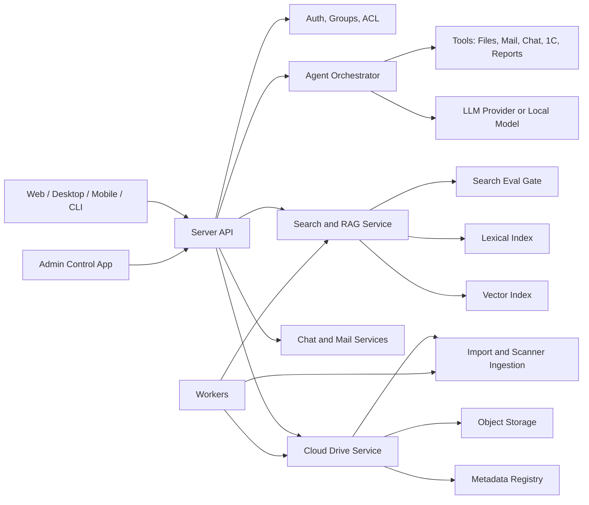

# Product Roadmap

Дата: 2026-05-27

Статус: рабочая стратегическая карта после первого internal release. Этот документ описывает целевой продукт и следующие фазы развития. Детальная история закрытого релизного этапа остается в `docs/RELEASE_ROADMAP.md`.

## 1. Целевой продукт

Проект развивается из внутреннего RAG-каталога в коммерческую корпоративную платформу:

- корпоративное облако документов;
- поиск конкретных файлов и информации внутри документов;
- права доступа на документы, папки, результаты поиска и будущие ответы агента;
- веб-интерфейс, серверная часть, CLI и нативное приложение контроля;
- клиенты синхронизации для Windows, Linux, macOS, Android и iOS;
- в следующих фазах: чат, почта, интеграции и агент для работы с файлами, документами и 1C.

Короткая формулировка цели:

> Корпоративное облако с поиском, RAG, правами доступа, синхронизацией, коммуникациями и будущим агентом, который может отвечать по данным компании, обрабатывать вложения, заполнять документы и выполнять бизнес-действия через интеграции.

## 2. Выводы из опроса

### 2.1 Продуктовая форма

Начальная стадия: корпоративное облако, где пользователь может найти файл или информацию внутри документов.

Дальше:

1. чат внутри продукта;
2. почта внутри продукта;
3. агентный слой: текстовые, голосовые и файловые команды;
4. интеграция с 1C и другими бизнес-системами;
5. коммерческая подписочная модель.

### 2.2 Пользователи и доступ

Нужны сценарии:

- сотрудник ищет и открывает документы;
- сотрудник делится документом с другим человеком;
- пользователь общается в чате и получает файлы/ссылки;
- пользователь работает с почтой;
- администратор управляет пользователями, правами, индексом, хранилищем и ошибками;
- внешний клиент или подрядчик получает ограниченный доступ к отдельным документам или папкам.

Это означает, что модель доступа должна быть не вспомогательной функцией, а ядром продукта.

### 2.3 Приоритет функций

Приоритет по ответам:

1. Cloud Drive как корпоративное хранилище.
2. Автоматизация обработки входящих документов.
3. Быстрый и надежный поиск файлов.
4. RAG-ответы с цитатами и проверкой источников.

Практическая трактовка: сначала продукт должен быть надежным облаком и поиском. Агент и дорогие LLM-функции подключаются поверх, когда данные, права и качество поиска уже устойчивы.

### 2.4 Источник истины для файлов

Целевой источник истины: Cloud Drive внутри приложения.

Но сканеры и часть внешних систем будут продолжать писать в сетевые папки. Поэтому нужен ingestion layer:

- watched/import folders для сканеров;
- правила автоматического импорта;
- карантин и диагностика ошибок;
- сохранение оригинального источника в provenance;
- возможность не ломать рабочие процессы, где устройство умеет писать только в SMB/папку.

### 2.5 Права, SSO и compliance

Точно нужны группы, наследование прав и аудит.

Пояснение терминов:

- SSO: вход через корпоративную учетную запись, без отдельного пароля в приложении.
- OIDC: современный протокол для SSO через провайдеров вроде Microsoft Entra ID, Keycloak, Google Workspace.
- AD/LDAP: интеграция с доменной структурой Windows и группами Active Directory.
- Compliance: юридически и организационно важные функции: неизменяемый аудит, сроки хранения, запрет удаления, legal hold, экспорт действий пользователя по документу.

Рекомендация: для первых продаж не начинать с полного compliance. Сначала сделать локальных пользователей, группы, аудит и аккуратную модель прав. SSO/OIDC добавить перед продажей компаниям, где уже есть домен или корпоративный identity provider.

### 2.6 Масштаб

Начальный масштаб: до 100 тыс. файлов.

Целевой рост: больше файлов и больше клиентов, но архитектуру нужно развивать поэтапно. На первом коммерческом этапе лучше продавать single-tenant deployment: отдельный сервер/контур на клиента. Это проще, безопаснее и быстрее для выхода на рынок, чем сразу строить общий multi-tenant SaaS.

### 2.7 Deployment и клиенты

Сервер:

- Docker как основной способ запуска;
- web UI;
- CLI;
- нативное приложение контроля;
- отдельные worker-процессы по мере роста.

Клиенты:

- web;
- desktop sync client;
- в будущем virtual drive или системная папка;
- мобильные приложения;
- фоновые sync-процессы, где это позволяет ОС.

### 2.8 LLM/RAG стратегия

Модель зависит от бюджета клиента:

- низкий бюджет: основной акцент на обычный поиск, фильтры, быстрый просмотр, точные совпадения;
- средний бюджет: локальная небольшая модель для query expansion, резюме и уточнения поиска;
- высокий бюджет: сильная внешняя или выделенная модель для агента по файлам, документам и 1C.

Вывод: LLM слой должен быть заменяемым. Нельзя жестко привязывать продукт к одной модели или одному провайдеру.

### 2.9 Риски по приоритету

Текущий порядок рисков:

1. качество поиска;
2. скорость поиска;
3. UI/удобство;
4. права доступа и безопасность;
5. развертывание и сопровождение;
6. надежность индексации.

Надежность индексации уже существенно проработана, но остается обязательной эксплуатационной базой. Главный следующий фокус: качество/скорость поиска и понятный пользовательский продукт.

## 3. Рекомендуемая стратегия выхода на рынок

### 3.1 Не строить сразу большой SaaS

Лучший путь для первых клиентов:

1. single-tenant сервер на клиента;
2. Docker Compose или простой installer;
3. локальное или S3-совместимое хранилище;
4. локальные пользователи и группы;
5. понятная лицензия/подписка;
6. ручная поддержка первых внедрений.

Причина: multi-tenant SaaS резко повышает требования к изоляции данных, биллингу, мониторингу, резервному копированию, incident response и юридической ответственности. Для первых продаж это лишняя сложность.

### 3.2 SaaS оставить как отдельную фазу

Multi-tenant SaaS нужен позже, когда будут понятны:

- типичные размеры клиентов;
- стоимость хранения и embeddings;
- нагрузка на поиск;
- требования к SSO;
- средний бюджет на LLM;
- юридические требования к данным.

## 4. Целевая архитектура

Основные границы:

- Server API: единая точка доступа для web, клиентов, CLI и будущих приложений.
- Auth/ACL: пользователи, группы, роли, наследование прав, аудит.
- Cloud Drive Service: папки, файлы, версии, корзина, sharing, storage backend.
- Search and RAG Service: индекс, retrieval, citations, eval, access filtering.
- Workers: индексация, OCR, импорт, cleanup, sync jobs, тяжелые операции.
- Chat/Mail: отдельный домен данных, но с доступом к файлам через API и ACL.
- Agent Orchestrator: слой инструментов, бюджетов, политик безопасности и подтверждения действий.

## 5. Недостающие компоненты и мешающие факторы

### 5.1 Cloud Drive как продукт

Недостает:

- удобного registry search по имени, пути, типу, дате, размеру;
- bulk operations: move, delete, reindex, download ZIP, restore;
- sharing links and external access;
- квот и ограничений;
- стабильного sync client;
- virtual drive/folder experience;
- storage hardening: streaming, multipart upload, checksum verification, object GC.

Мешает:

- продукт сейчас ближе к рабочему internal tool, чем к облаку для клиента;
- правовая модель есть, но sharing и внешние пользователи еще не оформлены как продуктовый сценарий;
- клиенты синхронизации требуют отдельного жизненного цикла и тестирования по ОС.

### 5.2 Поиск и RAG

Недостает:

- структурного чанкинга DOCX/PDF/XLSX;
- provenance до страницы, листа, строки, версии файла;
- обязательного eval gate для изменений retrieval;
- профилирования latency и кэшей;
- explain mode: почему найден результат;
- UX для точного поиска, фильтров и смешанного поиска.

Мешает:

- качество поиска является главным риском;
- RAG будет слабым, если citations и provenance недостаточно точные;
- дорогой агент нельзя строить поверх нестабильного retrieval.

### 5.3 UI и продуктовые сценарии

Недостает:

- цельного сценария "облако документов" вместо набора админских экранов;
- быстрого preview документов;
- понятных действий в explorer;
- sharing UX;
- уведомлений;
- onboarding первого администратора и клиента;
- мобильных сценариев.

Мешает:

- UI сейчас обслуживает и пользователя, и администратора;
- нужно развести повседневный интерфейс и админский контроль;
- без polish первых клиентов будет трудно убедить, даже если backend сильный.

### 5.4 Безопасность и доступы

Недостает:

- группы и управление членством;
- ACL UI для папок/файлов;
- external sharing policy;
- audit export;
- Qdrant-side ACL filtering для больших объемов;
- SSO/OIDC/AD на следующем коммерческом этапе.

Мешает:

- sharing, chat, mail и agent увеличивают риск утечки данных;
- агент должен видеть только то, что видит пользователь;
- внешние пользователи требуют более строгих политик доступа.

### 5.5 Интеграции и автоматизация

Недостает:

- import folders для сканеров;
- обработка входящих документов;
- правила классификации;
- шаблоны документов;
- интеграция с 1C;
- tool registry для агента;
- human approval для рискованных действий.

Мешает:

- агент без контроля может изменить данные неправильно;
- 1C-интеграции отличаются у клиентов;
- нужна модель прав не только на файлы, но и на действия.

### 5.6 Deployment и сопровождение

Недостает:

- installer/release packaging;
- backup/restore;
- migration runner;
- health dashboard;
- support bundle export;
- license/subscription enforcement;
- versioned upgrade path.

Мешает:

- первые клиенты потребуют простого обновления и восстановления;
- без support bundle диагностика будет дорогой;
- коммерческий продукт требует контроля версии и лицензии.

## 6. Roadmap

### Phase 0. Закрепить текущий internal release

Цель: довести существующий RAG Catalog до состояния, которое можно уверенно показывать знакомым как ранний продукт.

Статус 2026-05-27: baseline подтвержден на `main`.

- `main` синхронизирован с `origin/main`, рабочее дерево чистое.
- Full tests: `python -m pytest -q` -> 513 passed, 4 warnings.
- Static checks: `python -m ruff check src tests scripts` -> green.
- Cloud Drive focused tests: 101 passed.
- Launcher status: web и Qdrant running; Telegram bot down из-за timeout к `api.telegram.org`, token в диагностике редактируется.
- Search eval: Recall@10 0.875, MRR 0.953125, zero-result 0.0, p50 983 ms, p95 2369 ms.
- Docker smoke: web и Qdrant поднялись на изолированных портах `18080`/`16333`, оба health probes вернули HTTP 200; smoke stack остановлен.
- Следующий search-quality риск: категории `exact_number_or_vehicle` и `document_type` дают меньший recall, чем folder/name и OCR сценарии.

Задачи:

- зафиксировать текущий release tag после чистого CI;
- закрыть текущие незакоммиченные изменения по индексатору, форматам, архивам и логам отдельными focused commits;
- проверить fresh install по README;
- проверить Docker smoke;
- проверить Cloud Drive upload -> index -> search -> download -> delete;
- снять baseline search eval и latency;
- обновить screenshots/smoke UI.

Done criteria:

- `git status --short` чистый перед tag;
- focused tests green;
- full pytest либо green, либо известные non-release blockers явно записаны;
- есть короткая инструкция установки для первого внешнего тестера.

### Phase 1. Commercial MVP: корпоративное облако + поиск

Цель: первая версия для знакомых и пилотных клиентов.

Статус:

- DONE 2026-05-27: backend contract для registry search расширен до pagination/filter slice: `limit`, `offset`, `next_offset`, `total`, `node_type`, `extension`, `mime_type`; API добирает страницу после ACL-фильтрации, чтобы запрещенные документы не создавали пустую страницу при наличии разрешенных результатов дальше.
- DONE 2026-05-27: backup/restore basics добавлены в Cloud Drive CLI: zip snapshot config + локальные SQLite state файлы с WAL checkpoint перед упаковкой; restore умеет безопасно разворачивать backup в отдельную директорию или по configured paths с `--force`.
- DONE 2026-05-27: support bundle export добавлен в launcher: redacted config, launcher status, runtime pid markers и tails сегментированных логов в одном zip.
- DONE 2026-05-27: первый search-quality sprint закрыл часть weak spots: eval учитывает морфологию, content snippets и доменные aliases, `nDCG` снова bounded 0..1; добавлены алиасы `touareg`/`туарег`/`фольксваген`; `паспорт PC300` больше не перехватывается spreadsheet numeric scan и ранжирует model PDF выше шильдиков/калькуляций. Search eval gate после правок: Recall@10 0.921875, p50 1131 ms, p95 2930 ms.
- DONE 2026-05-27: model PDF boost для паспортных запросов сужен до точного entity-token в имени файла и исключает страховые документы, чтобы `touareg O50 vin птс стс` не поднимал ОСАГО или случайные `doc050...pdf` выше ПТС/СТС-like результатов. Search eval gate после правки: Recall@10 0.921875, p50 1414 ms, p95 3195 ms.
- DONE 2026-05-27: VIN-доменный слой добавлен в lexical/BM25/eval/default aliases: `vin lovol` поднимает `Шильдик Foton Lovol FL966H.jpg` первым, а ПТС/СТС считаются релевантными носителями VIN при совпадении контекста машины. Search eval gate после правки: Recall@10 0.953125, MRR 0.984375, p50 1643 ms, p95 3817 ms.
- DONE 2026-05-27: service/requisites-доменный слой добавлен для `реквизиты обслуживания технических услуг`: `реквизит` связывается с карточкой предприятия, а `обслуживание`/`технические услуги` с `Услуги`/`ремонт`/`сервис`. Search eval gate после правки: Recall@10 0.96875, MRR 1.0, p50 1453 ms, p95 3316 ms.
- DONE 2026-05-27: eval semantics для model-only PDF паспортов уточнена: если запрос ожидает `паспорт`/`ПСМ`, PDF с совпавшей entity (`PC300`, `6357`) засчитывается как релевантный паспорт, а фото без PDF - нет. Search eval gate после правки: Recall@10 1.0, MRR 1.0, zero-result 0.0, p50 1440 ms, p95 3283 ms.
- DONE 2026-05-27: release smoke повторен после baseline: launcher status показывает web/Qdrant up, Cloud Drive CLI stats green (`76205` files, `109836` versions, pending jobs `0`), support bundle/backup/restore green; Docker smoke исправлен на default isolated ports `18080`/`16333` и health probes вернули HTTP 200. Runtime warning: Telegram bot down из-за timeout к `api.telegram.org` при включенном токене.
- DONE 2026-05-27: Cloud Drive preview включен для storage-backed файлов: API `GET /api/cloud-drive/preview` отдает local storage inline, explorer/search открывают drawer просмотра без зависимости от исходного `source_path`, ACL/session проверяются тем же контуром, что download.
- DONE 2026-05-27: backend scanner/import ingestion добавлен: `cloud_import_sources`, durable `import` jobs, CLI `import-source-add/list/run`, admin API для import sources, копирование новых/изменённых файлов в storage и постановка `reindex` только для изменившихся версий.

Состав:

- Cloud Drive как основной источник истины;
- watched/import folders для сканеров;
- пользователи, группы, роли, ACL;
- поиск по файлам и содержимому;
- фильтры по типу, дате, папке, владельцу;
- preview/download/version/trash/restore;
- admin center: health, jobs, index coverage, storage status;
- Docker deployment;
- backup/restore basics;
- license key или простая подписочная проверка.

Ключевые задачи:

- registry search с ACL и pagination;
- UI sharing для внутренних пользователей;
- import folders and scanner ingestion backend done; следующий слой - UI управления источниками и расписание;
- search quality v2: eval cases под реальные документы;
- latency profiling and cache tuning;
- ACL management UI;
- support bundle export;
- backup and restore command;
- release installer/script.

### Phase 2. Sync and client experience

Цель: сделать облако удобным не только через web.

Состав:

- desktop sync client для Windows в первую очередь;
- background sync;
- selective sync;
- conflict inbox;
- device revoke;
- resumable upload/download;
- push/SSE или другой механизм быстрых изменений;
- позже macOS/Linux;
- позже mobile clients.

Ключевые задачи:

- sync protocol hardening;
- local folder mapping;
- conflict model;
- device identity and revocation;
- bandwidth and retry policy;
- client logs and support export;
- auto-update strategy.

### Phase 3. Search/RAG Pro

Цель: сделать поиск и ответы главным конкурентным преимуществом.

Состав:

- structural chunking v2;
- page/sheet/row/slide provenance;
- parent-child retrieval;
- citations на конкретную версию файла;
- RAG answer with safe fallback;
- model profiles by budget;
- optional reranker;
- query expansion for low/medium hardware;
- evaluation dashboard.

Ключевые задачи:

- DOCX sections/tables chunks;
- PDF page/block chunks;
- XLSX sheet/row/table chunks;
- citation UI;
- eval gate in CI for retrieval changes;
- latency budgets by deployment profile;
- model provider abstraction.

### Phase 4. Chat and notifications

Цель: добавить коммуникационный слой вокруг документов.

Состав:

- chat между пользователями;
- файлы и ссылки из Cloud Drive в сообщениях;
- поиск по сообщениям с учетом прав;
- уведомления о sharing, комментариях, задачах, ошибках;
- Telegram/внешние каналы как интеграции, а не основа продукта.

Ключевые задачи:

- message store;
- participants and permissions;
- attachment model through Cloud Drive;
- notifications service;
- retention policy for messages;
- moderation/admin audit basics.

### Phase 5. Mail

Цель: встроить почту как источник документов и коммуникаций.

Состав:

- подключение почтовых ящиков;
- импорт писем и вложений;
- поиск по письмам;
- сохранение вложений в Cloud Drive;
- правила маршрутизации;
- audit and retention.

Ключевые задачи:

- mail connector abstraction;
- IMAP/SMTP or provider-specific integration decision;
- attachment ingestion;
- deduplication;
- permissions mapping;
- mail search index.

### Phase 6. Agent Platform

Цель: агент, который отвечает на вопросы, анализирует вложения, заполняет документы и выполняет действия через инструменты.

Состав:

- agent orchestrator;
- tool registry;
- model routing by budget and privacy;
- MCP-compatible tool layer where it is useful;
- file tools: read, summarize, compare, extract, fill templates;
- chat/mail tools;
- 1C tools;
- approval workflow for risky actions;
- audit trail for every action.

Ключевые задачи:

- permissions-aware tool execution;
- prompt and policy layer;
- attachment understanding pipeline;
- voice command ingestion;
- document template filling;
- report generation;
- human confirmation;
- rollback or compensating actions where possible.

Критическое правило:

> Агент не должен иметь больше прав, чем пользователь, от имени которого он действует.

### Phase 7. 1C and business automation

Цель: приблизиться к "агенту 1C" и бизнес-операциям.

Состав:

- connector to 1C;
- read-only analytics first;
- document creation and correction later;
- invoice/facture/photo extraction;
- reconciliation reports;
- approval chain;
- customer-specific adapters.

Ключевые задачи:

- определить минимальный read-only API к 1C;
- создать sandbox/test connector;
- mapping между файлами, контрагентами, документами и 1C-сущностями;
- audit and approval;
- tenant-specific configuration.

### Phase 8. Enterprise and SaaS

Цель: масштабировать коммерческую модель.

Состав:

- SSO/OIDC/AD;
- group sync;
- audit export;
- retention/legal hold;
- quotas;
- billing/subscription management;
- multi-tenant SaaS decision;
- dedicated deployments for larger customers;
- observability and incident operations.

Ключевые задачи:

- identity provider integration;
- tenant isolation model;
- billing events;
- usage metering: users, storage, indexed files, LLM usage;
- backup and disaster recovery policy;
- SLA and support process.

## 7. Ближайший порядок работ

Рекомендуемый порядок после текущего search-quality baseline:

1. Снять повторяемый release smoke: Docker, launcher, Cloud Drive registry/storage/CLI, backup/restore, support bundle.
2. Спроектировать Commercial MVP backlog: Cloud Drive product UX, groups/ACL UI, registry search, import folders.
3. Сделать backend MVP sprint: import/watched folders, ACL edge cases, registry search filters, audit trail.
4. Сделать product UX sprint: explorer, preview, sharing, admin center.
5. Сделать deployment sprint: installer, backup/restore policy, support bundle, license basics.
6. Подготовить pilot checklist и отдать первым знакомым на пилот.

## 8. Открытые вопросы

1. Первые продажи будут on-premise/single-tenant или нужен hosted SaaS сразу?
2. Какие ОС у первых клиентов: только Windows или есть macOS/Linux?
3. Нужно ли внешнее sharing по публичной ссылке или только приглашенные пользователи?
4. Какие типы документов самые важные для качества поиска: сканы, PDF, Excel, Word, почта, фото?
5. Нужна ли интеграция с доменом Windows у первых клиентов?
6. Нужно ли хранить почту внутри продукта или достаточно индексировать внешние ящики?
7. Какая 1C-конфигурация первая: Бухгалтерия, УТ, ERP, ЗУП или кастомная?
8. Где граница автоматических действий агента: только предложить или разрешить изменять данные после подтверждения?

## 9. Архитектурные решения на сейчас

- Cloud Drive становится главным доменом продукта.
- Сетевые папки остаются входным каналом, а не главным источником истины.
- Права доступа и аудит развиваются до агентного слоя, а не добавляются в конце.
- Search/RAG должен быть измеряемым через eval, иначе качество будет деградировать незаметно.
- Первый коммерческий путь: single-tenant deployments, multi-tenant SaaS позже.
- LLM слой должен быть заменяемым: local, cheap remote, premium remote.
- 1C agent начинается с read-only аналитики и отчетов, затем переходит к изменениям данных через approval.
